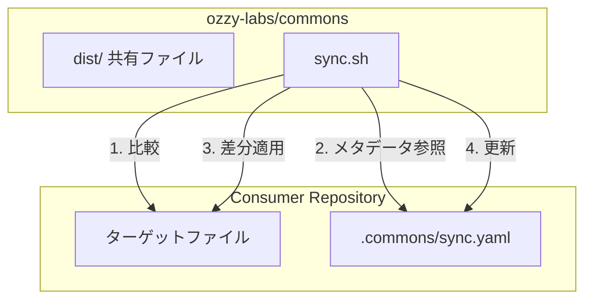
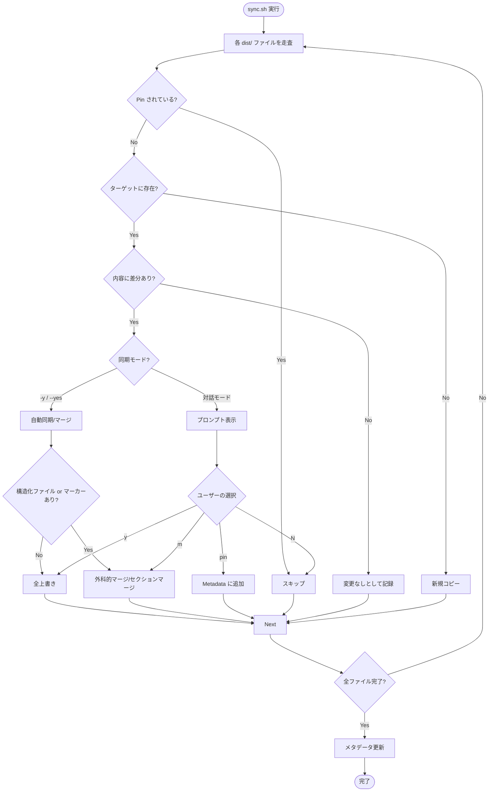

# 同期フロー (Sync Flow)

`sync.sh` による配布ファイルの同期プロセスを図解します。

## 全体アーキテクチャ

## 同期ロジック詳細

## マージ方式の使い分け

| 方式 | 対象 | 特徴 |
|---|---|---|
| **全上書き (Copy)** | すべてのファイル | 常に `dist/` の内容で完全に置き換える（デフォルト） |
| **外科的マージ (Surgical)** | JSON, YAML | `yq` を使用。`dist/` のキーで上書きしつつ、個別キーは維持する |
| **セクションマージ (Marker)** | すべて（特に MD, YAML） | `<!-- begin: ... -->` 内のコンテンツのみを置換。外側は維持する |
